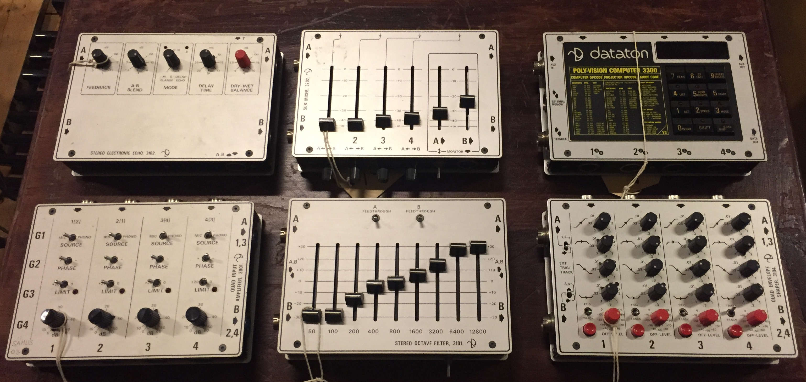

#+TITLE:     Beyond the unnecessary self
#+SUBTITLE: the giving up of the self
#+EMAIL:    henrik.frisk@kmh.se
#+NAME: Henrik Frisk
#+DATE: June 27, 2024
#+DESCRIPTION:
#+STARTUP: indent
#+STARTUP: overview
#+KEYWORDS: teaching, composition
#+LANGUAGE: en
#+OPTIONS: toc:nil num:nil

#+REVEAL_ROOT: https://cdn.jsdelivr.net/npm/reveal.js

#+REVEAL_INIT_OPTIONS: width:1600, height:800, controlsLayout: 'edges'
#+REVEAL_THEME: black
#+REVEAL_TRANS: fade
#+REVEAL_TITLE_SLIDE: <h1>%t</h1><h3>%s</h3>
%d

%a - %e

#+REVEAL_TITLE_SLIDE_BACKGROUND: img/kmh-white2.png
#+REVEAL_TITLE_SLIDE_BACKGROUND_SIZE: 1600px
#+REVEAL_TITLE_SLIDE_BACKGROUND_REPEAT: 
#+REVEAL_SLIDE_FOOTER:
#+REVEAL_MARGIN: 0.1

# title slide background
#+REVEAL_DEFAULT_SLIDE_BACKGROUND:
#+REVEAL_DEFAULT_SLIDE_BACKGROUND_SIZE:
#+REVEAL_DEFAULT_SLIDE_BACKGROUND_POSITION:
#+REVEAL_DEFAULT_SLIDE_BACKGROUND_REPEAT:
#+REVEAL_DEFAULT_SLIDE_BACKGROUND_TRANSITION:

# Change the MIN_SCALE to make the presentation fit in a smaller window. 
# See also the script at the bottom of the generated file

#+REVEAL_MIN_SCALE: 0.2
#+REVEAL_MAX_SCALE: 2.5
#+REVEAL_HLEVEL: 1
#+REVEAL_HEAD_PREAMBLE: <meta name="description" content="Slide presentation.">
#+REVEAL_POSTAMBLE: 
 Henrik Frisk 

#+REVEAL_PLUGINS: (markdown notes)
# #+REVEAL_DEFAULT_FRAG_STYLE: fade-out
#+REVEAL_EXTRA_CSS: ./local.css

#+MACRO: color @@html:$2@@

# @@html:

@@

* COMMENT Tree slide settings
#+begin_src emacs-lisp
  (when (require 'org-tree-slide nil t)
    (setq org-tree-slide-skip-comments 'inherit)
    (setq org-tree-slide-skip-done nil)
    (require 'org-tree-slide-pauses)
    (setq org-image-actual-width nil)
    (setq org-tree-slide-content-margin-top 5)
    )

  ;; For a light theme
;;    (load-theme 'tango t)
   (custom-set-faces
;;    '(org-quote ((t (:inherit org-block :background "white smoke"))))
    '(org-tree-slide-header-overlay-face ((t (:inherit default))))
 ;;   '(shadow ((t (:foreground "gainsboro"))))
    )
#+end_src

#+RESULTS:

#+begin_src emacs-lisp
  (set-window-margins (selected-window) 40 40)
  (setq line-spacing 0.5)
  ;; (text-scale-increase 1)
  (setq org-fontify-emphasized-text 1)
  (setq org-format-latex-options (plist-put org-format-latex-options :scale 1.0))
;;  (set-frame-font "Helvetica 12" nil t)
#+end_src

#+RESULTS:
| :foreground | default | :background | default | :scale | 1.0 | :html-foreground | Black | :html-background | Transparent | :html-scale | 1.0 | :matchers | (begin $1 $ $$ \( \[) |

* Introduction
/The (un)necessary self/ [cite:@Frisk2013]

-- /giving up of the self/ --

/move the focus from the creator to what is created and to understand the roles of the various agents involved/
** The powers of commodification
#+ATTR_REVEAL: :frag (appear)
 - the artistic output
 - the artist
 - the listeners
 
* Freedom of art
The complexities of the freedom of art is threatened

** Radicalization
#+begin_quote
in the radicalization of the role of the creator, both a new work concept and a review of the self is necessary, even beyond the notion of giving up of the self
#+end_quote

** Moral values
#+begin_quote
the moral values that are expressed through artistic practices in music, specifically improvisation, may complement traditional views on ethics
#+end_quote

** Foucault
The notion of the /Care of the Self/ (Michel Foucault's Volume Three of the /History of Sexuality/) is used as a method to approach this complex area
* The care of the self
** The care of the self
a self that is rooted in "practices of freedom" [cite:@Foucault1997-2; p. 283]
#+begin_quote
"Freedom is the ontological condition of ethics. But ethics is the considered form that freedom takes when it is informed by reflection" [cite:@Foucault1997-2; p. 284]
#+end_quote
** The care of the self
#+begin_quote
When you take care of the body you do not take care of the self. The self is not clothing, tools, or possessions; It is to be found in the principle that uses these tools, a principle not of the body of the soul. 
#+end_quote
** The care of the self
#+begin_quote
You have to worry about your soul--that is the principal activity for caring for yourself. The care of the self is the care of the activity and not the care of the soul-as-substance.
#+end_quote
** The aesthetics of the creative act
The principle that uses the tools of artistic practice is in essence the aesthetics of the creative act: the practice itself.
** Focus on relations between self and others
#+ATTR_REVEAL: :frag (appear)
- they exist
- they matter
- they need to be good and respctful

(though good and respectful can mean a lot of things in art practices)

** Not an ethics of instruments...
...but a developed sense of ethics through a deep understanding for relations.

Deconstructs the subject/object.

* Sounds of Future Past
#+ATTR_HTML: :width 600

** An ethics of instruments
is leaning on

- the material aspects
- mediations
- telos
  
  of an instrument can provide grounds for an analysis of its /ethics/

** Technologies of the Self
The use Foucault's creterias from the /Technologies of the Self/

** Strange
to speak of an ethics of objects when not all human enjoy ethical rights

* Dataton 3000

** The Dataton
:PROPERTIES:
:reveal_background: img/DATATON-01.png
:reveal_background_trans: slide
:END:

What is the difference between the traditional method for musical interpretation, rooted in Western musical practices (really art history), and the excavation of the technological and cultural significances of a particular electronic musical instrument of the past?

@@html:
(see Roland Barthes in the famous essay <em>The death of the Author</em>)
@@

** Historically informed practice?
To attempt to understand the qualities and the particularity of this instrument a wide range of parameters need to be considered related.

Not only origin.

** Media archaeology

by learning from early electronic instruments it is possible to better understand the complexities of these practices:

media archaeology

* Design history
- inventive design is commercialized
- becomes mainstrem
- originals forgotten

** About the synthesizer
#+begin_quote
"from a flexible variety of possible control configurations, the synthesizer eventually stabilised into a keyboard instrument" [cite:@Pinch1998]
#+end_quote

** Market forces
.. exclude the loosers and standardize the winners.

* Not the objects themselves
** The free play
#+ATTR_REVEAL: :frag (appear)
- the interactions  made possible by engaging in an artistically driven play with the objects
- a free play that does not have a purpose and no particular meaning
- though it may well develop in other directions in the future.

  Improvisation is part of the method that allows me to do this.

* Deconstructing the originator
** Difference?
What is the difference between the traditional method for musical interpretation and the excavation of the technological and cultural significances of a particular electronic musical instrument of the past?
#+ATTR_REVEAL: :frag (appear)
- the first has an originator at the centre
- the second supports a network of relations
** The added value?
- it opens up for an expanded ethical dimension of artistic practices that value the larger context
- the relationships between the various agents involved in their past and current practices
** Preliminary conclusion
As long as I care about the relation between myself and the instrument, and the instruments relation to its context, I can be free to follow my artistic and ethically informed intentions, and these will develop into a sort of freedomm in and of themselves.
 
* Giving up of the self

The /giving up of the self/ along with the /care of the self/ are not contradictions - they feed upon each other and allow for an approach and an epistemology of creativity that is more closely aligned with others than the solely the self.

* Thank you!
